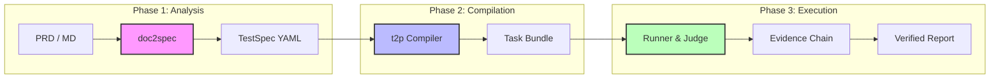

<div align="center">

# 🤖 TesterAgent

**Automatisierungsplattform für Tests von Dokument zu Agent in Industrieller Qualität**

*Dokumentengesteuerte intelligente, selbstausgleichende mobile Testplattform*

<p align="center">
  <a href="README.md">简体中文</a> •
  <a href="README.en.md">English</a> •
  <a href="README.de.md">Deutsch</a> •
  <a href="README.es.md">Español</a> •
  <a href="README.ru.md">Русский</a>
</p>

[Funktionen](#✨-funktionen) • [Architektur](#🏗️-architektur) • [Web-Konsole](#🖥️-web-konsole) • [Schnellstart](#🚀-schnellstart) • [Roadmap](#🗺️-roadmap)


---

[](https://www.python.org/downloads/)
[](https://nextjs.org/)
[](https://fastapi.tiangolo.com/)
[](LICENSE)

**Verwandeln Sie Anforderungsdokumente direkt in Testergebnisse.**  
TesterAgent konvertiert PRDs in natürlicher Sprache automatisch in strukturierte Testspezifikationen, führt sie über intelligente Agenten auf echten Geräten aus und erstellt Testberichte mit einer vollständigen Beweiskette.

</div>

---

## ✨ Funktionen

### 1. 📄 Dokument als Code
Kein manuelles Schreiben von Testskripten mehr. Markdown/PDF-PRDs einfügen, und das System extrahiert automatisch Testpunkte, um standardisierte `TestSpec`-Dateien zu generieren.

### 2. 🧠 Agentengesteuerte Ausführung
LLM-basierte adaptive Test-Engine. Keine Selektoren erforderlich, keine feste Wartelogik. Der Agent versteht den Bildschirm und schließt Ziele wie ein Mensch ab.

### 3. 🛡️ Produktionsreife Sicherheit
- **Guards (Schutzzonen)**: Identifiziert und beschränkt automatisch Hochrisikoaktionen (z. B. Zahlungen, Kontolöschung).
- **Human-in-the-loop**: Kritische Pfade (wie 2FA) lösen automatisch manuelle Übernahmeanfragen aus.

### 4. 📊 Evidenzbasierte Entscheidung
Keine „Black-Box“-Urteile. Jede Assertion muss mit spezifischen OCR-/Bildnachweisen verknüpft sein, um eine 100-prozentige Rückverfolgbarkeit zu gewährleisten.

### 5. 🖥️ Web-Konsole mit vollem Funktionsumfang
Moderne Verwaltungsoberfläche mit Echtzeit-Bildschirmspiegelung (Live View), Überwachung der Aufgaben-Pipeline und tiefer Historien-Rückverfolgung.

---

## 🏗️ Architektur

TesterAgent verwendet eine dreischichtige Pipeline-Architektur, um sicherzustellen, dass jeder Schritt von der Anforderung bis zur Ausführung deterministisch und konfigurierbar ist.



---

## 🖥️ Web-Konsole

**TesterAgent bietet ein minimalistisches und dennoch leistungsstarkes Web-Management-Dashboard.**

> [!TIP]
> Verwenden Sie die Web-Konsole zur Verwaltung großer Mengen gleichzeitiger Aufgaben.

- **Echtzeit-Spiegelung**: Gerätebildschirmspiegelung mit Millisekunden-Latenz zur Verfolgung von Agentenoperationen.
- **Aufgaben-Pipeline**: Visualisieren Sie den gesamten Prozess: Kompilieren -> Ausführen -> Beurteilen -> Berichten.
- **Gerätezentrum**: Verbinden Sie physische ADB/HDC-Geräte mit Ein-Klick-Sperre/Entsperrung.
- **Übernahmeaufforderungen**: Interaktionsanfragen werden automatisch eingeblendet, wenn der Agent auf spezielle Knoten wie Anmeldung oder Zahlung stößt.

---

## 🚀 Schnellstart

### Voraussetzungen
- Python 3.10+
- Node.js 18+ (für die Web-Konsole)
- ADB / HDC-Umgebung (für Tests mit echten Geräten)

### 1. Backend-Installation
```bash
git clone https://github.com/your-org/TesterAgent.git
cd TesterAgent
python3 -m venv .venv
source .venv/bin/activate
pip install -e ".[dev,zhipu]"

# Umgebungsvariablen konfigurieren
cp .env.example .env
# ZHIPU_API_KEY ausfüllen
```

### 2. Frontend installieren und starten
```bash
cd web
npm install
npm run dev
```

### 3. End-to-End CLI Workflow
```bash
# Spezifikation aus Dokument kompilieren
doc2spec compile examples/wechat_prd.md -o out/

# In Agenten-Task kompilieren
t2p compile out/specs/wechat_prd-TS-001.yaml -o bundles/

# Auf physischem Gerät ausführen (Geräte-ID angeben)
runner run bundles/wechat_prd-TS-001_bundle/ --device "YOUR_ADB_ID"
```

---

## 📂 Kernkomponenten

| Komponente | Beschreibung | Ausgabe |
| :--- | :--- | :--- |
| **doc2spec** | Anforderungserkennung & Spezifikationssynthese | `.yaml` (TestSpec) |
| **t2p** | Agenten-Policy-Compiler | `Task Bundle` (Prompts + Policies) |
| **runner** | Ausführung & Beweiserhebung | `steps.jsonl` + `screenshots/` |
| **verdict** | Evidenzbasierte atomare Beurteilung | `verdict.json` (Grund für Bestehen/Nichtbestehen) |

---

## 🗺️ Roadmap

- [x] **v0.1** - Kern-Pipeline mit drei Schichten (Basis)
- [x] **v0.5** - Next.js Web-Konsole & WebSocket Live View
- [x] **v1.0** - Thread-externe Kompilierungslogik, Multitasking-Verwaltung
- [ ] **v1.2** - Modellintegration: Unterstützung für GPT-4o / Claude 3.5 für Assertions
- [ ] **v1.5** - Ein-Klick-Export von Testberichten in PDF/Excel
- [ ] **v2.0** - Parallele Ausführung für HarmonyOS / iOS

---

## 📄 Lizenz

Dieses Projekt ist unter der [MIT-Lizenz](LICENSE) lizenziert.

---

<div align="center">

**[Dokumentation](docs/intro.md) | [Beitrag leisten](CONTRIBUTING.md) | [Kontaktieren Sie uns](mailto:hwangshuaige@gmail.com)**

Built with ⚡ by Sharon & TesterAgent Team

</div>
