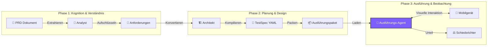

<div align="center">


# ⚡ TesterAgent

**Dokumente als Tests, wie Magie! ✨**

*Die intelligente Automatisierungsplattform, die Anforderungen in Testberichte verwandelt*

<p align="center">
  <a href="README.md">简体中文 🇨🇳</a> •
  <a href="README.en.md">English 🇺🇸</a> •
  <a href="README.de.md">Deutsch 🇩🇪</a> •
  <a href="README.es.md">Español 🇪🇸</a> •
  <a href="README.ru.md">Русский 🇷🇺</a>
</p>

[](https://www.python.org/)
[](https://nextjs.org/)
[](https://www.zhipuai.cn/)
[](LICENSE)

</div>

---

## 🚀 Willkommen in der neuen Ära der Testautomatisierung

**Verabschieden Sie sich von anfälligen Skripten, nutzen Sie die Kraft intelligenter Agenten!**

Müde davon, Skripte zu warten, die bei jeder UI-Änderung kaputtgehen?
TesterAgent ändert das Spiel. Sie stellen einfach ein **PRD-Dokument** (Word, PDF, Markdown oder URL) zur Verfügung, und wir erledigen den Rest.

Es ist nicht nur ein Werkzeug, sondern ein **Digitaler Mitarbeiter** mit **menschlichem Verständnis** und **visueller Wahrnehmung**, der unermüdlich End-to-End-Akzeptanztests für Sie durchführt. 📱⚡

---

## ✨ Kernfunktionen (Core Features)

### 1. 📖 Dokumentengetriebenes Testen
**Von Anforderungen direkt zu Berichten.**
Kein zeilenweises Schreiben von Testcode mehr. Das System liest Ihre Produktdokumentation mit LLMs, dekonstruiert automatisch die Geschäftslogik und generiert ausführbare Testspezifikationen. Es versteht sowohl einfache Beschreibungen als auch komplexe geschäftliche Einschränkungen.

### 2. 👁️ Visuelle Wahrnehmung
**"Sieht" den Bildschirm wie ein Mensch.**
Vergessen Sie fragile `id`- oder `xpath`-Selektoren. TesterAgent verwendet fortschrittliche Vision-Language Models (VLM), um Screenshots in Echtzeit zu analysieren und Schaltflächen sowie Symbole anhand visueller Merkmale zu lokalisieren. Selbst wenn sich das UI-Layout ändert: Solange ein Benutzer es sehen kann, findet der Agent es.

### 3. 🛡️ Sicherheitsleitplanken
**Intelligente Risikokontrolle.**
Eingebaute strenge Sicherheitsrichtlinien. Bei risikoreichen Operationen wie echten Zahlungen, Kontolöschungen oder Datenschutzfreigaben erkennt der Agent diese automatisch und löst Schutzmechanismen aus (überspringen oder manuelle Bestätigung anfordern), um sicherzustellen, dass Ihre Produktionsumgebung absolut sicher ist.

### 4. 📊 Visuelle Beweise
**Transparenter Prozess, Wahrheit in Bildern.**
Jeder Klick, jede Eingabe und jede Zusicherung wird automatisch mit Screenshots und Protokollen erfasst. Testberichte sind nicht mehr nur `Pass/Fail`, sondern vollständige visuelle Geschichten, die Bugs nirgendwo verstecken lassen.

---

## 🛠️ Wie es funktioniert (Deep Dive)

Die Magie von TesterAgent liegt in seiner einzigartigen **Drei-Stufen-Pipeline**, die komplexe Testaufgaben in spezialisierte Workflows zerlegt.



### 🔍 Phase 1: Mining - "Lesen wie ein Analyst"
In dieser Phase agiert das LLM als **Senior Test Analyst**.
- **Context Mining**: Analysiert Dokumentenmetadaten, um die **Ziel-App** (z.B. JD vs. Taobao), die **Zielseite** und **Umgebungsspezifikationen** zu identifizieren.
- **Requirement Extraction**: Zerlegt lange Dokumente in atomare, testbare "Anforderungspunkte" und unterscheidet zwischen **Happy Paths**, **Ausnahmen** und **Randbedingungen**.

### 🏗️ Phase 2: Synthesis - "Entwerfen wie ein Architekt"
Das LLM agiert dann als **Testarchitekt** und wandelt Anforderungen in maschinenlesbare **TestSpecs** um.
- **YAML Generation**: Konvertiert natürliche Sprache in strukturiertes YAML.
- **Precondition Injection**: Fügt automatisch Einrichtungsschritte hinzu. Wenn beispielsweise nach einem Produkt gesucht wird, fügt es Anweisungen wie "App starten" und "Sicherstellen, dass eingeloggt" hinzu.
- **Assertion Design**: Entwirft Überprüfungspunkte. Es fragt: "Wenn dieser Schritt erfolgreich ist, was sollte auf dem Bildschirm erscheinen?" und generiert konkrete UI-Zusicherungen (z.B. `ui_text_present: "Zahlung erfolgreich"`).

### 🤖 Phase 3: Execution - "Bedienen wie ein Benutzer"
Der aufregendste Teil. Der **Multimodale Agent (VLM Agent)** übernimmt die Kontrolle.
- **Visual Grounding**: Erfasst Echtzeit-Screenshots des Telefons, kombiniert sie mit dem Ziel des aktuellen Schritts und berechnet präzise UI-Koordinaten mithilfe visueller Modelle.
- **Self-Correction**: Wenn ein Klick fehlschlägt oder eine Werbung erscheint, versucht der Agent, sie zu schließen oder es erneut zu versuchen, genau wie ein Mensch.
- **Take Over**: Bei komplexen Szenarien (wie CAPTCHAs) kann der Agent manuelles Eingreifen anfordern.

---

## ⚠️ Einschränkungen und Hinweise (Limitations)

Obwohl TesterAgent leistungsstark ist, gibt es in der aktuellen Version einige Einschränkungen:

1.  **Nur Android**: Unterstützt derzeit nur Android-Geräte (über ADB). iOS wird nicht unterstützt.
2.  **Ausführungsgeschwindigkeit**: Aufgrund der starken Nutzung von VLM dauert die Inferenz ca. 2-5 Sekunden pro Schritt, was langsamer ist als native Appium/Espresso-Skripte.
3.  **Verifizierungsumfang**: Unterstützt hauptsächlich visuelle UI-Verifizierung (Text/Icon). Datenbankstatus- oder API-Antwortverifizierung wird noch nicht unterstützt.
4.  **Kostenbewusstsein**: Intensive visuelle Analysen und Mining verbrauchen signifikante LLM-Token. Bitte überwachen Sie Ihr API-Nutzungskontingent.
    *   **Kostenschätzung**: Ein Standard-Testfall mit 10 Schritten verbraucht ca. **30k-50k Token** (inkl. multimodaler Eingabe). Basierend auf den aktuellen Preisen von visuellen Modellen (~¥10/1M Token) betragen die Kosten ca. **¥0.3 - ¥0.5 RMB pro Durchlauf**.
5.  **Halluzinationsrisiko**: Bei extrem überladenen oder nicht standardisierten UIs kann das VLM Elemente gelegentlich falsch interpretieren. Eine menschliche Überprüfung wird für kritische Pfade empfohlen.

---

## 🚀 Schnellstart (Quick Start)

### Voraussetzungen
- **Python 3.10+** (Backend Core)
- **Node.js 18+** (Web Konsole)
- **Android Gerät** (Echtes Gerät oder Emulator mit aktiviertem ADB)

### 1. Das Gehirn starten (Backend)
```bash
# Repository klonen
git clone https://github.com/your-org/TesterAgent.git
cd TesterAgent

# Virtuelle Umgebung erstellen
python3 -m venv .venv
source .venv/bin/activate

# Abhängigkeiten installieren (mit Zhipu AI Support)
pip install -e ".[dev,zhipu]"

# API Key konfigurieren
cp .env.example .env
# .env Datei bearbeiten und ZHIPU_API_KEY eintragen
```

### 2. Die Konsole starten (Frontend)
```bash
cd web
npm install
npm run dev
# Browser öffnen unter http://localhost:3000
```

---

## ❤️ Danksagung

Die multimodalen Interaktionsfähigkeiten dieses Projekts basieren auf der Open-Source-Arbeit von **Zhipu AI**.
Besonderer Dank geht an das **AutoGLM** Team für ihre Erforschung von Device Agents! 🚀

---

<div align="center">

**[📚 Dokumentation](docs/intro.md) | [🤝 Mitwirken](CONTRIBUTING.md) | [📫 Kontakt](mailto:hwangshuaige@gmail.com)**

Built with ❤️ by TesterAgent Team

</div>
