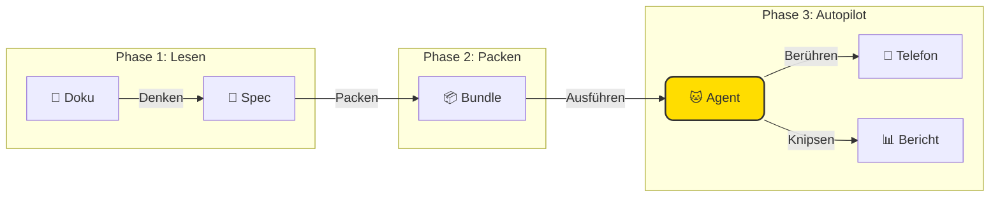

<div align="center">


# 🐱 TesterAgent

**Dokumentation ist Funktionalität, wie Magie! ✨**

*Eine intelligente Automatisierungsplattform, die PRD-Dokumente in Testberichte verwandelt.*

<p align="center">
  <a href="README.md">简体中文 🇨🇳</a> •
  <a href="README.en.md">English 🇺🇸</a> •
  <a href="README.de.md">Deutsch 🇩🇪</a> •
  <a href="README.es.md">Español 🇪🇸</a> •
  <a href="README.ru.md">Русский 🇷🇺</a>
</p>

[](https://www.python.org/)
[](https://nextjs.org/)
[](https://www.zhipuai.cn/)
[](LICENSE)

</div>

---

## 🐾 Miau~ Willkommen bei TesterAgent!

**Ich bin dein vollautomatischer Testassistent!** 
Müde davon, endlose Testskripte zu schreiben? Gestresst von häufigen Anforderungsänderungen?
Füttere mich einfach mit deinen PRD-Dokumenten und überlasse den Rest diesem intelligenten Kätzchen! Ich lese die Dokumente wie ein Mensch, nehme das Telefon und erledige alle Tests für dich! 📱⚡

> **Der Produktmanager sagt**:
> "Das ist nicht nur ein Testwerkzeug; es ist eine Plattform, die menschliche Sprache spricht. Präzise, niedlich und eine Freude zu benutzen!"

---

## ✨ Was sind meine Superkräfte? (Features)

### 1. 📖 Document-as-Code (Dokument als Code)
**Sag Nein zu mechanischer Arbeit!**
Du musst keinen Code Zeile für Zeile schreiben. Gib mir ein Produkt-Dokument in Markdown, und ich verstehe die Logik und generiere automatisch Testfälle. Mein Leseverständnis ist erstklassig! 🧠

### 2. 🤖 Agenten-gesteuerte Ausführung
**Ich habe Augen!**
Ich brauche keine kalten, harten `id` oder `xpath` Selektoren. Ich schaue auf den Bildschirm genau wie du und erkenne Buttons, Icons und Text. UI geändert? Kein Problem, ich kann den neuen Look sehen! 👀

### 3. 🛡️ Sicherheit geht vor
**Ich bin ein braves Kätzchen, ich benehme mich!**
Keine Sorge, ich habe Sicherheitsgeländer. Gefährliche Aktionen wie das Löschen von Konten oder Zahlungen sind ohne deine Erlaubnis strengstens verboten. Deine Produktionsumgebung ist sicher bei mir. 🔒

### 4. 📸 Evidenz-basiertes Urteil
**Fotos oder es ist nicht passiert!**
Ich sage dir nicht einfach "Bestanden" oder "Fehlgeschlagen". Ich mache Screenshots von jedem Schritt. Sieh genau, was passiert ist und wo es schief gelaufen ist. Keine Diskussionen mehr! 📷

### 5. 🖥️ Wunderschöne Web-Konsole
**Arbeit sollte schön sein!**
Mächtige Funktionen verpackt in einem wunderschönen Design. Sieh mir bei der Arbeit über die Live-Bildschirmspiegelung zu und verfolge jeden Schritt in der Pipeline-Ansicht. Wer hat gesagt, dass Entwickler-Tools hässlich sein müssen? 🎨

---

## 🏗️ Wie arbeite ich? (Architektur)

Es ist wirklich einfach. Nur drei Schritte:



---

## 🚀 Adoptionsleitfaden (Schnellstart)

### Katzenfutter (Anforderungen)
- Python 3.10+
- Node.js 18+ (Für die hübsche UI)
- Ein Android-Telefon, verbunden über ADB

### 1. Wecke das Backend auf
```bash
git clone https://github.com/your-org/TesterAgent.git
cd TesterAgent
python3 -m venv .venv
source .venv/bin/activate
pip install -e ".[dev,zhipu]"

# Vergiss meinen Zhipu API Key nicht!
cp .env.example .env
# Bearbeite .env und trage den Key ein
```

### 2. Starte die hübsche UI
```bash
cd web
npm install
npm run dev
# Öffne http://localhost:3000
```

---

## ❤️ Besonderer Dank

Dieses Projekt profitiert immens von der Open-Source-Arbeit von **Zhipu AI**.
Großen Dank an das **AutoGLM**-Team für ihre herausragenden Beiträge zur Community, die es Agenten ermöglichen, Telefone so reibungslos zu steuern! 🚀

---

<div align="center">

**[📚 Dokumentation](docs/intro.md) | [🤝 Mitwirken](CONTRIBUTING.md) | [📫 Kontakt](mailto:hwangshuaige@gmail.com)**

Erstellt mit ❤️ & 🐱 von Sharon & dem TesterAgent Team

</div>
