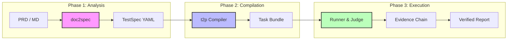

<div align="center">

# 🤖 TesterAgent

**Industrial-Grade Document-to-Agent Test Automation Platform**

*Document-Driven Intelligent Self-Balancing Mobile Test Platform*

<p align="center">
  <a href="README.md">简体中文</a> •
  <a href="README.en.md">English</a> •
  <a href="README.de.md">Deutsch</a> •
  <a href="README.es.md">Español</a> •
  <a href="README.ru.md">Русский</a>
</p>

[Features](#✨-features) • [Architecture](#🏗️-architecture) • [Web Console](#🖥️-web-console) • [Quick Start](#🚀-quick-start) • [Roadmap](#🗺️-roadmap)


---

[](https://www.python.org/downloads/)
[](https://nextjs.org/)
[](https://fastapi.tiangolo.com/)
[](LICENSE)

**Turn requirement documents directly into test results.**  
TesterAgent automatically converts natural language PRDs into structured test specifications, executes them on real devices via intelligent agents, and produces test reports with a complete evidence chain.

</div>

---

## ✨ Features

### 1. 📄 Document-as-Code
No more manual test script writing. Feed in Markdown/PDF PRDs, and the system automatically extracts test points to generate standardized `TestSpec` files.

### 2. 🧠 Agent-Led Execution
LLM-based adaptive test engine. No selectors needed, no fixed wait logic. The Agent understands the screen and completes goals like a human.

### 3. 🛡️ Production-Ready Safety
- **Guards**: Automatically identifies and restricts high-risk actions (e.g., payments, account deletion).
- **Human-in-the-loop**: Critical paths (like 2FA) automatically trigger manual takeover requests.

### 4. 📊 Evidence-Based Verdict
No "black-box" judgments. Every assertion must be linked to specific OCR/image evidence, ensuring 100% traceability.

### 5. 🖥️ Full-Featured Web Console
Modern management interface with real-time screen mirroring (Live View), task pipeline monitoring, and deep history traceback.

---

## 🏗️ Architecture

TesterAgent uses a three-layer pipeline architecture to ensure every step from requirement to execution is deterministic and configurable.



---

## 🖥️ Web Console

**TesterAgent provides a minimalist yet powerful Web management dashboard.**

> [!TIP]
> Use the Web Console for managing large-scale concurrent tasks.

- **Real-time Mirroring**: Millisecond-latency device screen mirroring to track Agent operations.
- **Task Pipeline**: Visualize the entire process: Compile -> Run -> Judge -> Report.
- **Device Center**: Connect ADB/HDC physical devices with one-click lock/unlock.
- **Takeover Prompts**: Interaction requests pop up automatically when the Agent hits special nodes like login or payment.

---

## 🚀 Quick Start

### Prerequisites
- Python 3.10+
- Node.js 18+ (for Web Console)
- ADB / HDC Environment (for real device testing)

### 1. Install Backend
```bash
git clone https://github.com/your-org/TesterAgent.git
cd TesterAgent
python3 -m venv .venv
source .venv/bin/activate
pip install -e ".[dev,zhipu]"

# Configure environment variables
cp .env.example .env
# Fill in ZHIPU_API_KEY
```

### 2. Install & Start Frontend
```bash
cd web
npm install
npm run dev
```

### 3. End-to-End CLI Workflow
```bash
# Compile spec from document
doc2spec compile examples/wechat_prd.md -o out/

# Compile into Agent task
t2p compile out/specs/wechat_prd-TS-001.yaml -o bundles/

# Run on physical device (specify device ID)
runner run bundles/wechat_prd-TS-001_bundle/ --device "YOUR_ADB_ID"
```

---

## 📂 Core Components

| Component | Description | Output |
| :--- | :--- | :--- |
| **doc2spec** | Requirement mining & Spec synthesis | `.yaml` (TestSpec) |
| **t2p** | Agent policy compiler | `Task Bundle` (Prompts + Policies) |
| **runner** | Execution & evidence collection | `steps.jsonl` + `screenshots/` |
| **verdict** | Evidence-based atomic judgment | `verdict.json` (Pass/Fail Reason) |

---

## 🗺️ Roadmap

- [x] **v0.1** - Three-layer core pipeline (Baseline)
- [x] **v0.5** - Next.js Web Console & WebSocket Live View
- [x] **v1.0** - Off-thread compilation logic, multi-task management
- [ ] **v1.2** - Model Integration: Support GPT-4o / Claude 3.5 for assertions
- [ ] **v1.5** - One-click PDF/Excel test report export
- [ ] **v2.0** - HarmonyOS / iOS multi-platform parallel execution

---

## 📄 License

This project is licensed under the [MIT License](LICENSE).

---

<div align="center">

**[Documentation](docs/intro.md) | [Contributing](CONTRIBUTING.md) | [Contact Us](mailto:hwangshuaige@gmail.com)**

Built with ⚡ by Sharon & TesterAgent Team

</div>
