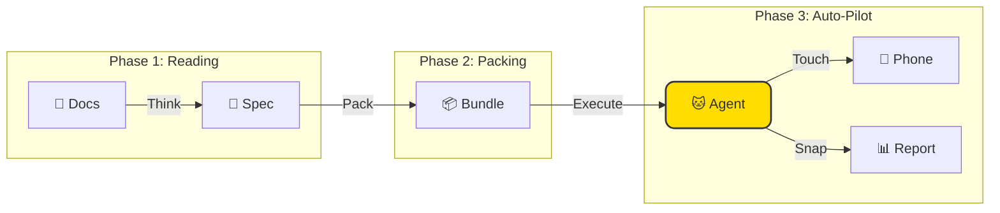

<div align="center">


# 🐱 TesterAgent

**Documentation is functionality, like magic! ✨**

*An intelligent automation platform that turns PRD docs into test reports.*

<p align="center">
  <a href="README.md">简体中文 🇨🇳</a> •
  <a href="README.en.md">English 🇺🇸</a> •
  <a href="README.de.md">Deutsch 🇩🇪</a> •
  <a href="README.es.md">Español 🇪🇸</a> •
  <a href="README.ru.md">Русский 🇷🇺</a>
</p>

[](https://www.python.org/)
[](https://nextjs.org/)
[](https://www.zhipuai.cn/)
[](LICENSE)

</div>

---

## 🐾 Meow~ Welcome to TesterAgent!

**I am your fully automated testing assistant!** 
Tired of writing endless test scripts? Stressed out by frequent requirement changes?
Just feed me your PRD documents, and leave the rest to this smart kitty! I'll read the docs like a human, pick up the phone, and finish all the testing for you! 📱⚡

> **Product Manager Says**:
> "This isn't just a testing tool; it's a platform that speaks human language. Precise, cute, and a joy to use!"

---

## ✨ What are my superpowers? (Features)

### 1. 📖 Document-as-Code
**Say no to mechanical work!**
No need to write code line by line. Give me a Markdown product document, and I'll understand the logic and generate test cases automatically. My reading comprehension is top-notch! 🧠

### 2. 🤖 Agent-Led Execution
**I have eyes!**
I don't need cold, hard `id` or `xpath` selectors. I look at the screen just like you do, recognizing buttons, icons, and text. UI changed? No problem, I can see the new look! 👀

### 3. 🛡️ Safety First
**I'm a good kitty, I behave!**
Don't worry, I have safety guardrails. Dangerous actions like deleting accounts or payments are strictly off-limits without your permission. Your production environment is safe with me. 🔒

### 4. 📸 Evidence-Based Verdict
**Pics or it didn't happen!**
I don't just tell you "Pass" or "Fail". I take screenshots of every step. See exactly what happened and where it went wrong. No more arguments! 📷

### 5. 🖥️ Beautiful Web Console
**Work should be beautiful!**
Powerful features wrapped in a gorgeous design. Watch me work via live screen mirroring, and track every step in the pipeline view. Who said dev tools have to be ugly? 🎨

---

## 🏗️ How do I work? (Architecture)

It's simple, really. Just three steps:



---

## 🚀 Adoption Guide (Quick Start)

### Cat Food (Requirements)
- Python 3.10+
- Node.js 18+ (For the pretty UI)
- An Android phone connected via ADB

### 1. Wake up the Backend
```bash
git clone https://github.com/your-org/TesterAgent.git
cd TesterAgent
python3 -m venv .venv
source .venv/bin/activate
pip install -e ".[dev,zhipu]"

# Don't forget my Zhipu API Key!
cp .env.example .env
# Edit .env and fill in the Key
```

### 2. Start the Pretty UI
```bash
cd web
npm install
npm run dev
# Open http://localhost:3000
```

---

## ❤️ Special Thanks

This project benefits greatly from the open-source work of **Zhipu AI**.
Big thanks to the **AutoGLM** team for their outstanding contributions to the community, enabling agents to control phones so smoothly! 🚀

---

<div align="center">

**[📚 Documentation](docs/intro.md) | [🤝 Contributing](CONTRIBUTING.md) | [📫 Contact](mailto:hwangshuaige@gmail.com)**

Built with ❤️ & 🐱 by Sharon & TesterAgent Team

</div>
