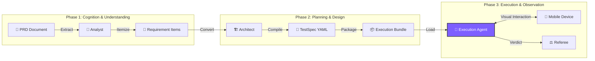

<div align="center">


# ⚡ TesterAgent

**Test Docs as Code, Like Magic! ✨**

*The Intelligent Automation Platform turning Requirements into Test Reports*

<p align="center">
  <a href="README.md">简体中文 🇨🇳</a> •
  <a href="README.en.md">English 🇺🇸</a> •
  <a href="README.de.md">Deutsch 🇩🇪</a> •
  <a href="README.es.md">Español 🇪🇸</a> •
  <a href="README.ru.md">Русский 🇷🇺</a>
</p>

[](https://www.python.org/)
[](https://nextjs.org/)
[](https://www.zhipuai.cn/)
[](LICENSE)

</div>

---

## 🚀 Welcome to the New Era of Test Automation

**Say goodbye to brittle scripts, embrace the power of Intelligent Agents!**

TIRED of maintaining scripts that break with every UI change?
TesterAgent changes the game. You simply provide a **PRD Document** (Word, PDF, Markdown, or URL), and we handle the rest.

It's not just a tool; it's a **Digital Employee** with **Human-level Understanding** and **Visual Perception**, tirelessly performing end-to-end acceptance testing for you. 📱⚡

---

## ✨ Core Features

### 1. 📖 Document-Driven Testing
**From Requirements directly to Reports.**
No more coding test cases line by line. The system reads your product documentation using LLMs, automatically deconstructs business logic, and generates executable Test Specs. It understands simple descriptions as well as complex business constraints.

### 2. 👁️ Vision-Based Execution
**"Sees" the screen like a human.**
Abandon fragile `id` or `xpath` selectors. TesterAgent uses advanced Vision-Language Models (VLM) to analyze screen screenshots in real-time, locating buttons and icons by visual features. Even if the UI layout changes, as long as a user can see it, the Agent can find it.

### 3. 🛡️ Safety Guardrails
**Smart Risk Control.**
Built-in strict safety policies. For high-risk operations like real payments, account deletion, or privacy authorization, the Agent automatically recognizes and triggers protection mechanisms (skipping or asking for manual confirmation), ensuring your production environment is absolutely safe.

### 4. 📊 Visual Evidence
**Transparent Process, Truth in Pictures.**
Every click, every input, and every assertion is automatically captured with screenshots and logs. Test reports are no longer just `Pass/Fail`, but complete visual stories, leaving bugs nowhere to hide.

---

## 🛠️ How It Works (Deep Dive)

The magic of TesterAgent comes from its unique **Three-Stage Pipeline**, decomposing complex testing tasks into specialized workflows handled by different LLM roles.



### 🔍 Phase 1: Mining - "Reading like an Analyst"
In this stage, the LLM acts as a **Senior Test Analyst**.
- **Context Mining**: Analyzes document metadata to identify the **Target App** (e.g., JD vs. Taobao), **Target Page**, and **Environment Specs**.
- **Requirement Extraction**: Deconstructs long documents into atomic, testable "Requirement Items", distinguishing between **Happy Paths**, **Exceptions**, and **Boundary Conditions**.

### 🏗️ Phase 2: Synthesis - "Designing like an Architect"
The LLM then acts as a **Test Architect**, converting requirements into machine-readable **TestSpecs**.
- **YAML Generation**: Converts natural language into structured YAML.
- **Precondition Injection**: Automatically injects setup steps. For example, if searching for a product, it adds "Launch App" and "Ensure Logged In" instructions.
- **Assertion Design**: Designs verification points. It asks: "If this step succeeds, what should appear on the screen?" generating concrete UI assertions (e.g., `ui_text_present: "Payment Success"`).

### 🤖 Phase 3: Execution - "Operating like a User"
The most exciting part. The **Multimodal Agent (VLM Agent)** takes control.
- **Visual Grounding**: Captures real-time phone screenshots, combines them with the current step's goal, and calculates precise UI coordinates using visual models.
- **Self-Correction**: If a click fails or an ad pops up, the Agent attempts to close it or retry, just like a human would.
- **Take Over**: For complex scenarios (like CAPTCHAs), the Agent can request manual intervention.

---

## ⚠️ Limitations & Notices

While TesterAgent is powerful, the current version has some limitations:

1.  **Android Only**: Currently supports only Android devices (via ADB). iOS is not supported.
2.  **Execution Speed**: Due to heavy VLM usage, inference takes about 2-5 seconds per step, making it slower than native Appium/Espresso scripts.
3.  **Verification Scope**: Primarily supports visual UI verification (text/icon). Database state or API response verification is not yet supported.
4.  **Cost Awareness**: Heavy visual analysis and mining consume significant LLM tokens. Please monitor your API usage quota.
    *   **Cost Estimate**: A standard test case with 10 steps consumes approx. **30k-50k Tokens** (including multimodal vision input). Based on current VLM pricing (~¥10/1M Tokens), the cost is approx. **¥0.3 - ¥0.5 RMB per run** (~$0.04 - $0.07 USD).
5.  **Hallucination Risk**: On extremely cluttered or non-standard UIs, VLM may occasionally misinterpret elements. Human review is recommended for critical paths.

---

## 🚀 Quick Start

### Prerequisites
- **Python 3.10+** (Backend Core)
- **Node.js 18+** (Web Console)
- **Android Device** (Real device or Emulator with ADB enabled)

### 1. Start the Brain (Backend)
```bash
# Clone the repository
git clone https://github.com/your-org/TesterAgent.git
cd TesterAgent

# Create virtual environment
python3 -m venv .venv
source .venv/bin/activate

# Install dependencies (with Zhipu AI support)
pip install -e ".[dev,zhipu]"

# Configure API Key
cp .env.example .env
# Edit .env and fill in your ZHIPU_API_KEY
```

### 2. Start the Console (Frontend)
```bash
cd web
npm install
npm run dev
# Open browser at http://localhost:3000
```

---

## ❤️ Credits

The core multimodal interaction capabilities of this project leverage the open-source work of **Zhipu AI**.
Special thanks to the **AutoGLM** team for their exploration in Device Agents, providing a strong foundation for this project! 🚀

---

<div align="center">

**[📚 Documentation](docs/intro.md) | [🤝 Contributing](CONTRIBUTING.md) | [📫 Contact](mailto:hwangshuaige@gmail.com)**

Built with ❤️ by TesterAgent Team

</div>
