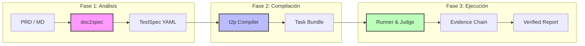

<div align="center">

# 🤖 TesterAgent

**Plataforma de Automatización de Pruebas de Documento a Agente de Grado Industrial**

*Plataforma de Pruebas Móviles Inteligente y Autobalanceada Impulsada por Documentos*

<p align="center">
  <a href="README.md">简体中文</a> •
  <a href="README.en.md">English</a> •
  <a href="README.de.md">Deutsch</a> •
  <a href="README.es.md">Español</a> •
  <a href="README.ru.md">Русский</a>
</p>

[Características](#✨-características) • [Arquitectura](#🏗️-arquitectura) • [Consola Web](#🖥️-consola-web) • [Inicio Rápido](#🚀-inicio-rápido) • [Hoja de Ruta](#🗺️-hoja-de-ruta)


---

[](https://www.python.org/downloads/)
[](https://nextjs.org/)
[](https://fastapi.tiangolo.com/)
[](LICENSE)

**Convierta los documentos de requisitos directamente en resultados de pruebas.**  
TesterAgent convierte automáticamente los PRD en lenguaje natural en especificaciones de prueba estructuradas, las ejecuta en dispositivos reales a través de agentes inteligentes y genera informes de prueba con una cadena de evidencia completa.

</div>

---

## ✨ Características

### 1. 📄 Documento como Código
No más escritura manual de scripts de prueba. Ingrese PRD en formato Markdown/PDF y el sistema extraerá automáticamente los puntos de prueba para generar archivos `TestSpec` estandarizados.

### 2. 🧠 Ejecución Dirigida por Agentes
Motor de pruebas adaptativo basado en LLM. No se necesitan selectores, no hay lógica de espera fija. El Agente entiende la pantalla y completa los objetivos como un humano.

### 3. 🛡️ Seguridad Lista para Producción
- **Guardias (Zonas Prohibidas)**: Identifica y restringe automáticamente acciones de alto riesgo (p. ej., pagos, eliminación de cuentas).
- **Humano en el bucle**: Las rutas críticas (como 2FA) activan automáticamente solicitudes de toma de control manual.

### 4. 📊 veredicto Basado en Evidencia
Sin juicios de "caja negra". Cada aseveración (assertion) debe estar vinculada a una evidencia específica de OCR/imagen, asegurando una trazabilidad del 100%.

### 5. 🖥️ Consola Web con Funciones Completas
Interfaz de gestión moderna con duplicación de pantalla en tiempo real (Live View), monitoreo de la canalización de tareas y seguimiento profundo del historial.

---

## 🏗️ Arquitectura

TesterAgent utiliza una arquitectura de canalización de tres capas para asegurar que cada paso, desde el requisito hasta la ejecución, sea determinista y configurable.



---

## 🖥️ Consola Web

**TesterAgent ofrece un panel de gestión web minimalista pero potente.**

> [!TIP]
> Use la Consola Web para gestionar tareas concurrentes a gran escala.

- **Duplicación en Tiempo Real**: Reflejo de la pantalla del dispositivo con latencia de milisegundos para seguir las operaciones del Agente.
- **Canalización de Tareas**: Visualice todo el proceso: Compilar -> Ejecutar -> Juzgar -> Informar.
- **Centro de Dispositivos**: Conecte dispositivos físicos ADB/HDC con bloqueo/desbloqueo de un solo clic.
- **Avisos de Toma de Control**: Las solicitudes de interacción aparecen automáticamente cuando el Agente llega a nodos especiales como inicio de sesión o pago.

---

## 🚀 Inicio Rápido

### Requisitos Previos
- Python 3.10+
- Node.js 18+ (para la Consola Web)
- Entorno ADB / HDC (para pruebas en dispositivos reales)

### 1. Instalar el Backend
```bash
git clone https://github.com/your-org/TesterAgent.git
cd TesterAgent
python3 -m venv .venv
source .venv/bin/activate
pip install -e ".[dev,zhipu]"

# Configurar variables de entorno
cp .env.example .env
# Completar ZHIPU_API_KEY
```

### 2. Instalar y Iniciar el Frontend
```bash
cd web
npm install
npm run dev
```

### 3. Flujo de Trabajo CLI de Extremo a Extremo
```bash
# Compilar especificación desde documento
doc2spec compile examples/wechat_prd.md -o out/

# Compilar en tarea de Agente
t2p compile out/specs/wechat_prd-TS-001.yaml -o bundles/

# Ejecutar en dispositivo físico (especificar ID de dispositivo)
runner run bundles/wechat_prd-TS-001_bundle/ --device "YOUR_ADB_ID"
```

---

## 📂 Componentes Principales

| Componente | Descripción | Salida |
| :--- | :--- | :--- |
| **doc2spec** | Minería de requisitos y síntesis de especificaciones | `.yaml` (TestSpec) |
| **t2p** | Compilador de políticas de Agente | `Task Bundle` (Prompts + Políticas) |
| **runner** | Motor de ejecución y recolección de evidencia | `steps.jsonl` + `screenshots/` |
| **verdict** | Sistema de juicio atómico basado en evidencia | `verdict.json` (Razón de Aprobación/Fallo) |

---

## 🗺️ Hoja de Ruta

- [x] **v0.1** - Canalización central de tres capas (Línea base)
- [x] **v0.5** - Consola Web Next.js y WebSocket Live View
- [x] **v1.0** - Lógica de compilación fuera de hilo, gestión multitarea
- [ ] **v1.2** - Integración de Modelos: Soporte para GPT-4o / Claude 3.5 para aseveraciones
- [ ] **v1.5** - Exportación de informes de prueba a PDF/Excel con un clic
- [ ] **v2.0** - Ejecución paralela multiplataforma HarmonyOS / iOS

---

## 📄 Licencia

Este proyecto está bajo la [Licencia MIT](LICENSE).

---

<div align="center">

**[Documentación](docs/intro.md) | [Contribuir](CONTRIBUTING.md) | [Contáctenos](mailto:hwangshuaige@gmail.com)**

Built with ⚡ by Sharon & TesterAgent Team

</div>
