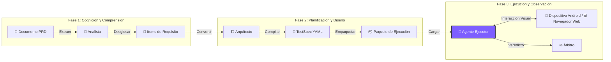

<div align="center">


# ⚡ TesterAgent

**¡Documentos como Tests, como magia! ✨**

*La plataforma de automatización inteligente que convierte requisitos en informes de prueba (Android & Web)*

<p align="center">
  <a href="README.md">简体中文 🇨🇳</a> •
  <a href="README.en.md">English 🇺🇸</a> •
  <a href="README.de.md">Deutsch 🇩🇪</a> •
  <a href="README.es.md">Español 🇪🇸</a> •
  <a href="README.ru.md">Русский 🇷🇺</a>
</p>

[](https://www.python.org/)
[](https://nextjs.org/)
[](https://www.zhipuai.cn/)
[](LICENSE)

</div>

---

## 🚀 Bienvenido a la Nueva Era de la Automatización de Pruebas

**¡Dile adiós a los scripts frágiles, abraza el poder de los Agentes Inteligentes!**

¿Cansado de mantener scripts que se rompen con cada cambio de interfaz?
TesterAgent cambia el juego. Simplemente proporciona un **Documento PRD** (Word, PDF, Markdown o URL), y nosotros nos encargamos del resto.

No es solo una herramienta; es un **Empleado Digital** con **comprensión humana** y **percepción visual**, realizando pruebas de aceptación de extremo a extremo para ti incansablemente. 📱⚡

---

## ✨ Características Principales (Core Features)

### 1. 📖 Pruebas Basadas en Documentos
**De Requisitos directamente a Informes.**
No más escribir código de prueba línea por línea. El sistema lee la documentación de tu producto usando LLMs, deconstruye automáticamente la lógica de negocio y genera Especificaciones de Prueba ejecutables. Entiende descripciones simples así como restricciones comerciales complejas.

### 2. 👁️ Ejecución Basada en Visión
**"Ve" la pantalla como un humano.**
Abandona los selectores frágiles `id` o `xpath`. TesterAgent utiliza Modelos de Visión-Lenguaje (VLM) avanzados para analizar capturas de pantalla en tiempo real, localizando botones e iconos por características visuales. Incluso si el diseño de la interfaz cambia, mientras un usuario pueda verlo, el Agente puede encontrarlo.

### 3. 🌐 Soporte Multiplataforma
**Cobertura tanto para Móvil como para Web.**
Ya sea que se trate de dispositivos físicos Android tradicionales o de aplicaciones Web modernas, TesterAgent maneja ambos con facilidad. Gestiona automáticamente desafíos específicos de la Web como inicios de sesión, redirecciones y navegación en varias ventanas.

### 4. 🛡️ Barreras de Seguridad
**Control de Riesgos Inteligente.**
Políticas de seguridad estrictas integradas. Para operaciones de alto riesgo como pagos reales, eliminación de cuentas o autorización de privacidad, el Agente reconoce y activa automáticamente mecanismos de protección (omitir o pedir confirmación manual), asegurando que tu entorno de producción sea absolutamente seguro.

### 5. 📊 Evidencia Visual
**Proceso Transparente, Verdad en Imágenes.**
Cada clic, cada entrada y cada aserción se captura automáticamente con capturas de pantalla y registros. Los informes de prueba ya no son solo `Pass/Fail`, sino historias visuales completas, dejando a los errores sin lugar donde esconderse.

---

## 🛠️ Cómo Funciona (Deep Dive)


La magia de TesterAgent proviene de su **Tubería de Tres Etapas** única, descomponiendo tareas de prueba complejas en flujos de trabajo especializados manejados por diferentes roles de LLM.



### 🔍 Fase 1: Minería - "Leyendo como un Analista"
En esta etapa, el LLM actúa como un **Analista de Pruebas Senior**.
- **Minería de Contexto**: Analiza los metadatos del documento para identificar la **App Objetivo** (por ejemplo, JD vs. Taobao), la **Página Objetivo** y las **Especificaciones del Entorno**.
- **Extracción de Requisitos**: Deconstruye documentos largos en "Ítems de Requisito" atómicos y probables, distinguiendo entre **Caminos Felices**, **Excepciones** y **Condiciones de Frontera**.

### 🏗️ Fase 2: Síntesis - "Diseñando como un Arquitecto"
El LLM luego actúa como un **Arquitecto de Pruebas**, convirtiendo requisitos en **TestSpecs** legibles por máquina.
- **Generación YAML**: Convierte lenguaje natural en YAML estructurado.
- **Inyección de Precondiciones**: Inyecta automáticamente pasos de configuración. Por ejemplo, si busca un producto, agrega instrucciones de "Iniciar App" y "Asegurar Sesión Iniciada".
- **Diseño de Aserción**: Diseña puntos de verificación. Pregunta: "¿Si este paso tiene éxito, qué debería aparecer en la pantalla?" generando aserciones de UI concretas (por ejemplo, `ui_text_present: "Pago Exitoso"`).

### 🤖 Fase 3: Ejecución - "Operando como un Usuario"
La parte más emocionante. El **Agente Multimodal (Agente VLM)** toma el control.
- **Visual Grounding**: Captura capturas de pantalla del teléfono en tiempo real, las combina con el objetivo del paso actual y calcula coordenadas de UI precisas usando modelos visuales.
- **Auto-Corrección**: Si un clic falla o aparece un anuncio, el Agente intenta cerrarlo o reintentar, tal como lo haría un humano.
- **Take Over**: Para escenarios complejos (como CAPTCHAs), el Agente puede solicitar intervención manual.

---

## ⚠️ Limitaciones y Avisos (Limitations)

Aunque TesterAgent es potente, la versión actual tiene algunas limitaciones:

1.  **Solo Android para Móviles**: Actualmente solo soporta dispositivos Android (vía ADB) para pruebas móviles. No hay soporte para iOS aún.
2.  **Soporte Web**: Soporta los navegadores principales (vía Playwright). La intervención humana puede ser necesaria para escenarios de Shadow DOM extremadamente complejos o MFA.
3.  **Velocidad de Ejecución**: Debido al uso intensivo de VLM, la inferencia toma alrededor de 2-5 segundos por paso, siendo más lento que scripts de automatización nativos.
4.  **Alcance de Verificación**: Principalmente soporta verificación visual de UI (texto/icono). La verificación de estado de base de datos o respuesta de API aún no está soportada.
4.  **Conciencia de Costos**: El análisis visual intensivo y la minería consumen tokens LLM significativos. Por favor, monitorea tu cuota de uso de API.
    *   **Estimación de Costos**: Un caso de prueba estándar con 10 pasos consume aprox. **30k-50k Tokens** (incluyendo entrada multimodal). Basado en el precio actual de modelos visuales (~¥10/1M Tokens), el costo es aprox. **¥0.3 - ¥0.5 RMB por ejecución**.
5.  **Riesgo de Alucinación**: En UIs extremadamente abarrotadas o no estándar, el VLM puede ocasionalmente malinterpretar elementos. Se recomienda revisión humana para rutas críticas.

---

## 🚀 Inicio Rápido (Quick Start)

### Prerrequisitos
- **Python 3.10+** (Núcleo Backend)
- **Node.js 18+** (Consola Web)
- **Entorno Android** (Dispositivo real o Emulador con ADB habilitado)
- **Entorno de Navegador** (Requiere dependencias de Playwright)

### 1. Iniciar el Cerebro (Backend)
```bash
# Clonar el repositorio
git clone https://github.com/your-org/TesterAgent.git
cd TesterAgent

# Crear entorno virtual
python3 -m venv .venv
source .venv/bin/activate

# Instalar dependencias (con Zhipu AI y controladores Web)
pip install -e ".[dev,zhipu]"
playwright install  # Instalar binarios del navegador

# Configurar API Key
cp .env.example .env
# Editar .env y rellenar tu ZHIPU_API_KEY
```

### 2. Iniciar la Consola (Frontend)
```bash
cd web
npm install
npm run dev
# Abrir navegador en http://localhost:3000
```

---

## ❤️ Créditos

Las capacidades de interacción multimodal de este proyecto aprovechan el trabajo de código abierto de **Zhipu AI**.
¡Un agradecimiento especial al equipo de **AutoGLM** por su exploración en Agentes de Dispositivos! 🚀

---

<div align="center">

**[📚 Documentación](docs/intro.md) | [🤝 Contribuir](CONTRIBUTING.md) | [📫 Contacto](mailto:hwangshuaige@gmail.com)**

Built with ❤️ by TesterAgent Team

</div>
