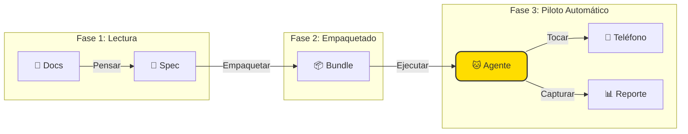

<div align="center">


# 🐱 TesterAgent

**¡La documentación es funcionalidad, como por arte de magia! ✨**

*Una plataforma de automatización inteligente que convierte documentos PRD en informes de prueba.*

<p align="center">
  <a href="README.md">简体中文 🇨🇳</a> •
  <a href="README.en.md">English 🇺🇸</a> •
  <a href="README.de.md">Deutsch 🇩🇪</a> •
  <a href="README.es.md">Español 🇪🇸</a> •
  <a href="README.ru.md">Русский 🇷🇺</a>
</p>

[](https://www.python.org/)
[](https://nextjs.org/)
[](https://www.zhipuai.cn/)
[](LICENSE)

</div>

---

## 🐾 ¡Miau~ Bienvenido a TesterAgent!

**¡Soy tu asistente de pruebas totalmente automatizado!** 
¿Cansado de escribir interminables scripts de prueba? ¿Estresado por los frecuentes cambios de requisitos?
¡Solo dame tus documentos PRD y déjale el resto a este gatito inteligente! Leeré los documentos como un humano, tomaré el teléfono y terminaré todas las pruebas por ti. 📱⚡

> **El Gerente de Producto dice**:
> "Esto no es solo una herramienta de prueba; es una plataforma que habla el lenguaje humano. ¡Precisa, linda y un placer de usar!"

---

## ✨ ¿Cuáles son mis superpoderes? (Características)

### 1. 📖 Document-as-Code (Documento como Código)
**¡Di no al trabajo mecánico!**
No necesitas escribir código línea por línea. Dame un documento de producto en Markdown y entenderé la lógica y generaré casos de prueba automáticamente. ¡Mi comprensión lectora es de primera! 🧠

### 2. 🤖 Ejecución Guiada por Agente
**¡Tengo ojos!**
No necesito selectores fríos y duros como `id` o `xpath`. Miro la pantalla igual que tú, reconociendo botones, iconos y texto. ¿Cambió la interfaz? ¡No hay problema, puedo ver el nuevo aspecto! 👀

### 3. 🛡️ Seguridad Ante Todo
**¡Soy un gatito bueno, me porto bien!**
No te preocupes, tengo medidas de seguridad. Acciones peligrosas como eliminar cuentas o pagos están estrictamente prohibidas sin tu permiso. Tu entorno de producción está a salvo conmigo. 🔒

### 4. 📸 Veredicto Basado en Evidencia
**¡Foto o no sucedió!**
No solo te digo "Aprobado" o "Fallido". Tomo capturas de pantalla de cada paso. Mira exactamente qué sucedió y dónde salió mal. ¡Se acabaron las discusiones! 📷

### 5. 🖥️ Consola Web Hermosa
**¡El trabajo debe ser bello!**
Potentes funciones envueltas en un diseño magnífico. Mírame trabajar a través de la duplicación de pantalla en vivo y sigue cada paso en la vista de tubería. ¿Quién dijo que las herramientas de desarrollo tienen que ser feas? 🎨

---

## 🏗️ ¿Cómo trabajo? (Arquitectura)

Es simple, de verdad. Solo tres pasos:



---

## 🚀 Guía de Adopción (Inicio Rápido)

### Comida para Gato (Requisitos)
- Python 3.10+
- Node.js 18+ (Para la interfaz bonita)
- Un teléfono Android conectado vía ADB

### 1. Despierta el Backend
```bash
git clone https://github.com/your-org/TesterAgent.git
cd TesterAgent
python3 -m venv .venv
source .venv/bin/activate
pip install -e ".[dev,zhipu]"

# ¡No olvides mi Clave API de Zhipu!
cp .env.example .env
# Edita .env y completa la Clave
```

### 2. Inicia la Interfaz Bonita
```bash
cd web
npm install
npm run dev
# Abre http://localhost:3000
```

---

## ❤️ Agradecimientos Especiales

Este proyecto se beneficia enormemente del trabajo de código abierto de **Zhipu AI**.
¡Muchas gracias al equipo de **AutoGLM** por sus destacadas contribuciones a la comunidad, permitiendo que los agentes controlen los teléfonos con tanta fluidez! 🚀

---

<div align="center">

**[📚 Documentación](docs/intro.md) | [🤝 Contribuir](CONTRIBUTING.md) | [📫 Contacto](mailto:hwangshuaige@gmail.com)**

Construido con ❤️ y 🐱 por Sharon y el Equipo TesterAgent

</div>
