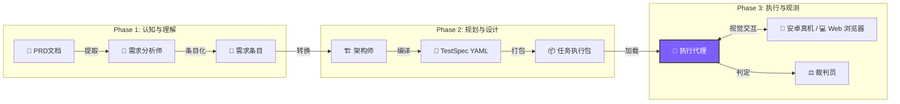

<div align="center">


# ⚡ TesterAgent

**文档即测试，像魔法一样！✨**

*让需求文档自动变身测试报告的智能自动化平台 (Android & Web)*

<p align="center">
  <a href="README.md">简体中文 🇨🇳</a> •
  <a href="README.en.md">English 🇺🇸</a> •
  <a href="README.de.md">Deutsch 🇩🇪</a> •
  <a href="README.es.md">Español 🇪🇸</a> •
  <a href="README.ru.md">Русский 🇷🇺</a>
</p>

[](https://www.python.org/)
[](https://nextjs.org/)
[](https://www.zhipuai.cn/)
[](LICENSE)

</div>

---

## 🚀 欢迎来到自动化测试的新纪元

**告别枯燥的脚本编写，拥抱智能代理 (Agent) 的力量！** 

是不是厌倦了维护永远在过期的测试脚本？是不是因为 UI 频繁变动而头秃？
TesterAgent 将改变这一切！你只需要提供一份 **PRD 文档**（Word, PDF, Markdown 甚至 URL），剩下的全部交给我们。

它不只是一个工具，更像是一个拥有**人类级理解力**和**视觉感知能力**的数字员工，不知疲倦地帮你完成端到端的验收测试。📱⚡

---

## ✨ 核心能力 (Core Features)

### 1. 📖 文档驱动 (Document-Driven)
**从需求直接到报告。**
不需要编写一行测试代码。系统通过大模型深度阅读产品文档，自动拆解业务逻辑，生成可执行的测试规格（TestSpec）。它读得懂简单的描述，也理解复杂的业务约束。

### 2. 👁️ 视觉感知 (Vision-Based Execution)
**像人类一样"看"屏幕。**
抛弃脆弱的 `id` 或 `xpath` 选择器。TesterAgent 使用先进的多模态模型 (VLM) 实时分析屏幕截图，通过视觉特征定位按钮和图标。即使 UI 布局调整，只要用户看得到，它就能找得到。

### 3. 🌐 多端支持 (Multi-Platform)
**移动端与 Web 端双覆盖。**
无论是传统的 Android 安卓真机，还是现代化的 Web 网页应用，TesterAgent 都能自如应对。它能自动处理 Web 端的登录跳转、多窗口切换等复杂场景。

### 4. 🛡️ 安全围栏 (Safety Guardrails)
**智能风控，安全无忧。**
内置严格的安全策略引擎。涉及真实支付、账号注销、隐私授权等高风险操作时，Agent 会自动识别并触发保护机制（自动跳过或请求人工确认），确保生产环境绝对安全。

### 5. 📊 证据链留存 (Visual Evidence)
**过程透明，有图有真相。**
每一次点击、每一次输入、每一次断言判定，系统都会自动截取屏幕快照并关联日志。测试报告不再是枯燥的 `Pass/Fail`，而是完整的图文故事，让 Bug 无处遁形。

---

## 🛠️ 它是如何工作的？(Deep Dive)


TesterAgent 的魔法源自其独特的**三段式流水线 (Three-Stage Pipeline)** 设计，我们将复杂的测试任务拆解为由于不同专长的大模型协作完成的工序。



### 🔍 Phase 1: 认知 (Mining) - "像分析师一样阅读"
在这个阶段，LLM 扮演**资深测试分析师**的角色。
- **Context Mining（上下文挖掘）**：不仅仅是提取文字，系统会首先分析文档的元数据（标题、开头），识别当前测试的 **目标应用**（是京东还是淘宝？）、**目标页面** 和 **环境要求**。
- **Requirement Extraction（原子化拆解）**：将长篇大论的文档拆解为一个个独立的、可测试的“需求条目”。它会自动区分 **正常路径 (Happy Path)**、**异常路径 (Exceptions)** 和 **边界条件**。

### 🏗️ Phase 2: 规划 (Synthesis) - "像架构师一样设计"
有了需求条目后，LLM 扮演**测试架构师**的角色，将其转化为机器可读的 **TestSpec (测试规格)**。
- **YAML Generation**：将自然语言的需求转化为结构化的 YAML 代码。
- **Precondition Injection**：自动注入前置条件。例如，如果需求是“搜索商品”，它会自动添加“启动 App”和“确保登录”的前置指令。
- **Assertion Design**：设计验证点。它会思考：“如果这一步成功了，屏幕上应该出现什么？”从而生成具体的 UI 断言（如 `ui_text_present: "支付成功"`）。

### 🤖 Phase 3: 执行 (Execution) - "像用户一样操作"
这是最激动人心的部分。**多模态代理 (VLM Agent) ** 接管控制权。
- **Visual Grounding**：Agent 获取手机实时截图，结合当前步骤的目标（如“点击搜索框”），利用视觉模型计算出 UI 元素的精确坐标。
- **Self-Correction (自愈)**：如果点击失败或弹出了广告窗，Agent 会像人类一样尝试关闭弹窗或重试，而不是直接报错退出。
- **Take Over (人机协同)**：遇到无法处理的复杂场景（如复杂的验证码），Agent 会主动请求人工介入。

---

## ⚠️ 局限性与注意事项 (Limitations)

虽然 TesterAgent 很强大，但目前版本仍存在以下局限性：

1.  **移动端仅支持 Android**：移动端目前仅适配 Android 设备（通过 ADB 连接），暂不支持 iOS 设备。
2.  **Web 支持**：Web 端支持主流浏览器（基于 Playwright），对于极其复杂的 Shadow DOM 或双重身份验证可能需要人机协助模式。
3.  **执行速度**：由于依赖多模态大模型 (VLM) 进行实时视觉分析，单步推断耗时约 2-5 秒，执行速度低于原生自动化脚本。
4.  **验证范围**：目前主要支持基于视觉（文本、图标）的 UI 验证。暂不支持数据库状态校验或 API 接口抓包验证。
4.  **成本提示**：大量的视觉分析和需求挖掘会消耗较多的 LLM Token，请注意监控 API 使用额度。
    *   **预估计算**：一个包含 10 个步骤的标准测试用例，全流程约消耗 **30k-50k Token**（含多模态图像输入）。按当前主流视觉模型定价（约 ¥10/100万 Token）计算，单次执行成本约 **¥0.3 - ¥0.5 RMB**。
5.  **幻觉风险**：在极度拥挤或非标准 UI 界面上，VLM 仍可能出现识别错误或幻觉，建议在关键步骤配合人工复核。

---

## 🚀 快速开始 (Quick Start)

### 环境准备
- **Python 3.10+** (后端核心)
- **Node.js 18+** (Web 控制台)
- **Android 环境** (真机或模拟器，需开启 ADB 调试)
- **浏览器环境** (需通过 `playwright install` 安装依赖)

### 1. 启动大脑 (Backend)
```bash
# 克隆仓库
git clone https://github.com/your-org/TesterAgent.git
cd TesterAgent

# 创建虚拟环境
python3 -m venv .venv
source .venv/bin/activate

# 安装依赖 (包含 Zhipu AI 与 Web 驱动)
pip install -e ".[dev,zhipu]"
playwright install  # 安装浏览器驱动

# 配置 API Key
cp .env.example .env
# 编辑 .env 文件，填入你的 ZHIPU_API_KEY
```

### 2. 启动控制台 (Frontend)
```bash
cd web
npm install
npm run dev
# 浏览器访问 http://localhost:3000
```

---

## ❤️ 致谢

本项目核心的多模态交互能力致敬并受益于 **智谱 AI (Zhipu AI)** 的开源工作。
特别感谢 **AutoGLM** 团队在 Device Agent 领域的探索，为本项目提供了强大的理论与实践基础！🚀

---

<div align="center">

**[📚 详细文档](docs/intro.md) | [🤝 参与贡献](CONTRIBUTING.md) | [📫 联系作者](mailto:hwangshuaige@gmail.com)**

Built with ❤️ by TesterAgent Team

</div>
