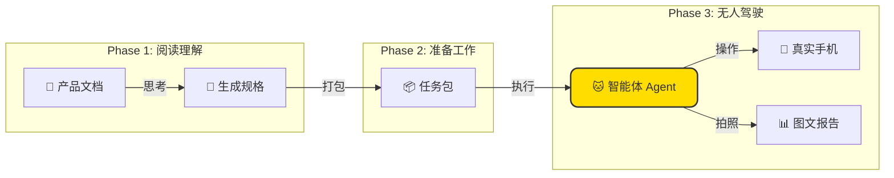

<div align="center">


# 🐱 TesterAgent

**文档即测试，像魔法一样！✨**

*让需求文档自动变身测试报告的智能自动化平台*

<p align="center">
  <a href="README.md">简体中文 🇨🇳</a> •
  <a href="README.en.md">English 🇺🇸</a> •
  <a href="README.de.md">Deutsch 🇩🇪</a> •
  <a href="README.es.md">Español 🇪🇸</a> •
  <a href="README.ru.md">Русский 🇷🇺</a>
</p>

[](https://www.python.org/)
[](https://nextjs.org/)
[](https://www.zhipuai.cn/)
[](LICENSE)

</div>

---

## 🐾 喵~ 欢迎来到 TesterAgent！

**我是你的全自动测试小助手！** 
是不是厌倦了写永远写不完的测试脚本？是不是因为需求变更频繁而头秃？
把 PRD 文档投喂给我，剩下的交给我这只智能小猫咪吧！我会像人类一样阅读文档，拿起手机，帮你完成所有的测试工作！📱⚡

> **产品经理说**：
> "这是一个能听懂人话的自动化平台。它不只要测得准，还要长得萌，用得爽！"

---

## ✨ 我有什么本领？(Features)

### 1. 📖 文档即用例 (Document-as-Code)
**拒绝机械劳动！**
不需要你一行行写代码。你给我一份 Markdown 格式的产品文档，我就能读懂里面的逻辑，自动生成测试用例。我的理解能力可是超强的哦！🧠

### 2. � 像人一样的执行力 (Agent-Led Execution)
**我是有眼睛的！**
我不需要那些冷冰冰的 `id` 或 `xpath`。我会像你一样看屏幕，识别按钮、图标和文字。界面改版了？没关系，我能看见新的样子！👀

### 3. 🛡️ 安全第一 (Safety First)
**我很乖，不乱动！**
放心，我内置了安全围栏。删除、支付、退出登录这些危险操作，没有你的允许我绝对不会碰！你的生产环境很安全。🔒

### 4. � 证据链判定 (Evidence-Based Verdict)
**有图有真相！**
我不仅告诉你测试通过了，还会把每一步的截图都拍下来给你看。哪里通过了，哪里报错了，一目了然。拒绝扯皮！📷

### 5. 🖥️ 超高颜值的控制台
**工作也要赏心悦目！**
不仅功能强大，界面更是经过精心设计。实时投屏让你看我干活，流水线视图清晰展示每一个步骤。谁说测试工具只能是黑乎乎的终端？🎨

---

## 🏗️ 我是如何工作的？(Architecture)

其实很简单，我分三步走：



---

## � 快速领养指南 (Quick Start)

### 准备猫粮 (环境依赖)
- Python 3.10+
- Node.js 18+ (为了漂亮的界面)
- 一台连着电脑的 Android 手机 (ADB)

### 1. 唤醒后端
```bash
git clone https://github.com/your-org/TesterAgent.git
cd TesterAgent
python3 -m venv .venv
source .venv/bin/activate
pip install -e ".[dev,zhipu]"

# 记得告诉我 Zhipu API Key 哦！
cp .env.example .env
# 编辑 .env 文件填入 Key
```

### 2. 启动漂亮的界面
```bash
cd web
npm install
npm run dev
# 然后打开浏览器访问 http://localhost:3000
```

---

## ❤️ 特别鸣谢

本项目部分核心能力致敬并受惠于 **智谱 AI (Zhipu AI)** 的开源工作。
感谢 **AutoGLM** 团队为开源社区带来的卓越贡献，让 Agent 能够如此丝滑地操控手机！🚀

---

<div align="center">

**[📚 详细文档](docs/intro.md) | [🤝 参与贡献](CONTRIBUTING.md) | [📫 联系作者](mailto:hwangshuaige@gmail.com)**

Built with ❤️ & 🐱 by Sharon & TesterAgent Team

</div>
