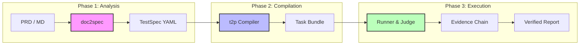

<div align="center">

# 🤖 TesterAgent

**Industrial-Grade Document-to-Agent Test Automation Platform**

*文档驱动的移动端智能自平衡测试平台*

<p align="center">
  <a href="README.md">简体中文</a> •
  <a href="README.en.md">English</a> •
  <a href="README.de.md">Deutsch</a> •
  <a href="README.es.md">Español</a> •
  <a href="README.ru.md">Русский</a>
</p>

[特性](#✨-特性) • [架构](#🏗️-核心架构) • [Web 控制台](#🖥️-web-控制台) • [快速开始](#🚀-快速开始) • [Roadmap](#🗺️-roadmap)

---


[](https://www.python.org/downloads/)
[](https://nextjs.org/)
[](https://fastapi.tiangolo.com/)
[](LICENSE)

**让需求文档直接变成测试结果。**  
TesterAgent 将自然语言 PRD 自动转化为结构化测试规格，通过智能体(Agent)在真实设备上执行，并产出具有完整证据链的测试报告。

</div>

---

## ✨ 特性

### 1. � 文档即用例 (Document-as-Code)
不再需要手动编写测试脚本。直接喂入 Markdown/PDF 格式的 PRD，系统自动挖掘测试点并生成标准化的 `TestSpec`。

### 2. 🧠 智能体驱动执行 (Agent-Led Execution)
基于大语言模型的自适应测试引擎。不需要定位符 (Selectors)，不需要固定的等待逻辑，Agent 像人类一样理解屏幕并完成目标。

### 3. 🛡️ 工业级安全防护 (Production-Ready Safety)
- **Guards 禁区**: 自动识别并限制高危动作（支付、删号）。
- **Human-in-the-loop**: 关键链路（如 2FA）自动触发人工接管请求。

### 4. 📊 证据链判定 (Evidence-Based Verdict)
拒绝“黑盒判定”。每一项断言 (Assertion) 都必须关联具体的 OCR/图像证据，确保测试结果 100% 可追溯。

### 5. 🖥️ 全功能 Web 控制台
现代化的管理界面，支持设备实时投屏 (Live View)、任务流水线监控、历史记录深度回溯。

---

## 🏗️ 核心架构

TesterAgent 采用三层管道架构，确保从需求到执行的每一步都是确定且可配置的。



---

## 🖥️ Web 控制台

**TesterAgent 提供了一个极致简约且高级的 Web 管理后台。**

> [!TIP]
> 推荐通过 Web 控制台管理大规模并发任务。

- **实时投屏**: 毫秒级感知的设备屏幕镜像，实时查看 Agent 操作。
- **任务流水线**: 编译 -> 运行 -> 判定 -> 报告，全流程可视化。
- **设备中心**: 接入 ADB/HDC 物理设备，一键锁定/解锁。
- **接管弹窗**: 当 Agent 遇到登录、支付等特殊节点时，前端自动弹出交互请求。

---

## 🚀 快速开始

### 环境依赖
- Python 3.10+
- Node.js 18+ (用于 Web Console)
- ADB / HDC 环境 (用于真机测试)

### 1. 安装后端
```bash
git clone https://github.com/your-org/TesterAgent.git
cd TesterAgent
python3 -m venv .venv
source .venv/bin/activate
pip install -e ".[dev,zhipu]"

# 配置环境变量
cp .env.example .env
# 填写 ZHIPU_API_KEY
```

### 2. 安装并启动前端
```bash
cd web
npm install
npm run dev
```

### 3. 端到端 CLI 流程
```bash
# 从文档生成规格
doc2spec compile examples/wechat_prd.md -o out/

# 编译为智能体任务
t2p compile out/specs/wechat_prd-TS-001.yaml -o bundles/

# 在物理设备上运行 (指定设备 ID)
runner run bundles/wechat_prd-TS-001_bundle/ --device "YOUR_ADB_ID"
```

---

## 📂 核心组件说明

| 组件 | 说明 | 核心输出 |
| :--- | :--- | :--- |
| **doc2spec** | 需求挖掘与規格合成 | `.yaml` (TestSpec) |
| **t2p** | 智能体策略编译器 | `Task Bundle` (Prompts + Policies) |
| **runner** | 执行与证据采集引擎 | `steps.jsonl` + `screenshots/` |
| **verdict** | 基于证据的原子判定系统 | `verdict.json` (Pass/Fail Reason) |

---

## 🗺️ Roadmap

- [x] **v0.1** - 三层架构核心管道 (Baseline)
- [x] **v0.5** - Next.js Web 控制台与 WebSocket 实时流 (Live View)
- [x] **v1.0** - 编译逻辑离线程化，支持高并发任务管理
- [ ] **v1.2** - 接入模型：支持 GPT-4o / Claude 3.5 定位断言
- [ ] **v1.5** - 自动化测试报告一键 PDF/Excel 导出
- [ ] **v2.0** - 支持 HarmonyOS / iOS 多平台并行执行

---

## 📄 开源协议

本项目采用 [MIT License](LICENSE) 开源。

---

<div align="center">

**[官方文档](docs/intro.md) | [贡献指南](CONTRIBUTING.md) | [联系我们](mailto:hwangshuaige@gmail.com)**

Built with ⚡ by Sharon & TesterAgent Team

</div>
