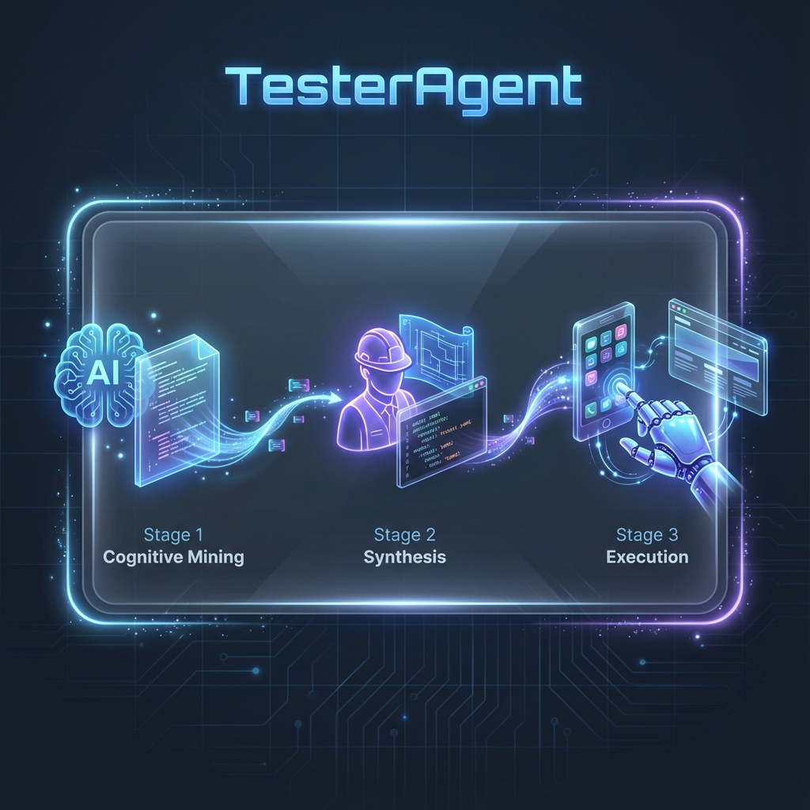
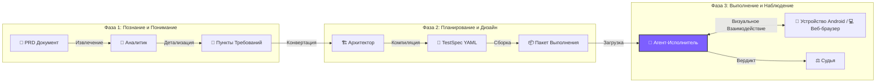

<div align="center">


# ⚡ TesterAgent

**Документация как Тест, Как Магия! ✨**

*Интеллектуальная платформа автоматизации, превращающая требования в отчеты о тестировании (Android & Web)*

<p align="center">
  <a href="README.md">简体中文 🇨🇳</a> •
  <a href="README.en.md">English 🇺🇸</a> •
  <a href="README.de.md">Deutsch 🇩🇪</a> •
  <a href="README.es.md">Español 🇪🇸</a> •
  <a href="README.ru.md">Русский 🇷🇺</a>
</p>

[](https://www.python.org/)
[](https://nextjs.org/)
[](https://www.zhipuai.cn/)
[](LICENSE)

</div>

---

## 🚀 Добро пожаловать в Новую Эру Автоматизации Тестирования

**Попрощайтесь с хрупкими скриптами, примите мощь Интеллектуальных Агентов!**

Устали поддерживать скрипты, которые ломаются при каждом изменении интерфейса?
TesterAgent меняет правила игры. Просто предоставьте **PRD Документ** (Word, PDF, Markdown или URL), и мы сделаем все остальное.

Это не просто инструмент, это **Цифровой Сотрудник** с **человеческим пониманием** и **визуальным восприятием**, неустанно выполняющий сквозное приемочное тестирование за вас. 📱⚡

---

## ✨ Основные Возможности (Core Features)

### 1. 📖 Тестирование на основе Документов
**От Требований напрямую к Отчетам.**
Больше не нужно писать код тестов строчка за строчкой. Система читает документацию вашего продукта с помощью LLM, автоматически деконструирует бизнес-логику и генерирует исполняемые Спецификации Тестов (Test Specs). Она понимает как простые описания, так и сложные бизнес-ограничения.

### 2. 👁️ Визуальное Восприятие
**"Видит" экран как человек.**
Откажитесь от хрупких селекторов `id` или `xpath`. TesterAgent использует передовые Vision-Language Models (VLM) для анализа скриншотов в реальном времени, определяя кнопки и иконки по визуальным признакам. Даже если макет интерфейса изменится, пока пользователь может это видеть, Агент сможет это найти.

### 3. 🌐 Мультиплатформенная поддержка
**Покрытие как для мобильных устройств, так и для веба.**
Будь то традиционные физические устройства Android или современные веб-приложения, TesterAgent с легкостью справляется и с тем, и с другим. Он автоматически управляет специфическими для веба задачами, такими как вход в систему, перенаправления и навигация в нескольких окнах.

### 4. 🛡️ Защитные Барьеры
**Умный Контроль Рисков.**
Встроенные строгие политики безопасности. Для операций с высоким риском, таких как реальные платежи, удаление аккаунта или разрешение доступа к личным данным, Агент автоматически распознает и активирует механизмы защиты (пропуск или запрос ручного подтверждения), обеспечивая абсолютную безопасность вашей производственной среды.

### 5. 📊 Визуальные Доказательства
**Прозрачный Процесс, Истина в Картинках.**
Каждый клик, каждый ввод и каждая проверка автоматически фиксируются скриншотами и логами. Отчеты о тестировании больше не просто `Pass/Fail`, а полные визуальные истории, не оставляющие багам места, чтобы спрятаться.

---

## 🛠️ Как это работает (Deep Dive)



Магия TesterAgent кроется в его уникальном **Трехступенчатом Конвейере**, разбивающем сложные задачи тестирования на специализированные рабочие процессы, управляемые разными ролями LLM.



### 🔍 Фаза 1: Mining - "Чтение как Аналитик"
На этом этапе LLM выступает в роли **Старшего Тест-Аналитика**.
- **Context Mining**: Анализирует метаданные документа для определения **Целевого Приложения** (напр., JD vs. Taobao), **Целевой Страницы** и **Спецификаций Среды**.
- **Requirement Extraction**: Деконструирует длинные документы на атомарные, тестируемые "Пункты Требований", различая **Счастливые Пути (Happy Paths)**, **Исключения** и **Граничные Условия**.

### 🏗️ Фаза 2: Synthesis - "Проектирование как Архитектор"
Затем LLM выступает в роли **Тест-Архитектора**, преобразуя требования в машиночитаемые **TestSpecs**.
- **YAML Generation**: Преобразует естественный язык в структурированный YAML.
- **Precondition Injection**: Автоматически внедряет шаги настройки. Например, если ищется товар, он добавляет инструкции "Запустить приложение" и "Убедиться, что выполнен вход".
- **Assertion Design**: Проектирует точки проверки. Он спрашивает: "Если этот шаг успешен, что должно появиться на экране?", генерируя конкретные проверки UI (напр., `ui_text_present: "Оплата прошла успешно"`).

### 🤖 Фаза 3: Execution - "Действие как Пользователь"
Самая захватывающая часть. **Мультимодальный Агент (VLM Agent)** берет управление на себя.
- **Visual Grounding**: Захватывает скриншоты телефона в реальном времени, комбинирует их с целью текущего шага и вычисляет точные координаты UI с помощью визуальных моделей.
- **Self-Correction**: Если клик не удался или всплыла реклама, Агент пытается закрыть её или повторить попытку, как это сделал бы человек.
- **Take Over**: В сложных сценариях (например, CAPTCHA) Агент может запросить ручное вмешательство.

---

## ⚠️ Ограничения и Примечания (Limitations)

Хотя TesterAgent мощен, текущая версия имеет некоторые ограничения:

1.  **Только Android для мобильных устройств**: В настоящее время поддерживаются только устройства Android (через ADB) для мобильного тестирования. iOS пока не поддерживается.
2.  **Поддержка веба**: Поддерживаются основные браузеры (через Playwright). Для чрезвычайно сложных сценариев Shadow DOM или MFA может потребоваться участие человека.
3.  **Скорость Выполнения**: Из-за интенсивного использования VLM, вывод занимает около 2-5 секунд на шаг, что медленнее, чем нативные скрипты автоматизации.
4.  **Область Проверки**: В основном поддерживается визуальная проверка UI (текст/иконки). Проверка состояния базы данных или ответов API пока не поддерживается.
4.  **Стоимость**: Интенсивный визуальный анализ и майнинг потребляют значительное количество токенов LLM. Пожалуйста, следите за квотой использования API.
    *   **Оценка Стоимости**: Стандартный тест-кейс из 10 шагов потребляет ок. **30k-50k Токенов** (включая мультимодальный ввод). Исходя из текущих цен на визуальные модели (~¥10/1M Токенов), стоимость составляет ок. **¥0.3 - ¥0.5 RMB за запуск**.
5.  **Риск Галлюцинаций**: В экстремально перегруженных или нестандартных UI, VLM может иногда неверно интерпретировать элементы. Рекомендуется ручная проверка для критических путей.

---

## 🚀 Быстрый Старт (Quick Start)

### Предварительные требования
- **Python 3.10+** (Ядро Бэкенда)
- **Node.js 18+** (Веб-консоль)
- **Среда Android** (Реальное устройство или Эмулятор с включенным ADB)
- **Браузерная среда** (Требуются зависимости Playwright)

### 1. Запуск Мозга (Backend)
```bash
# Клонирование репозитория
git clone https://github.com/your-org/TesterAgent.git
cd TesterAgent

# Создание виртуального окружения
python3 -m venv .venv
source .venv/bin/activate

# Установка зависимостей (с поддержкой Zhipu AI и веб-драйверов)
pip install -e ".[dev,zhipu]"
playwright install  # Установка бинарных файлов браузера

# Настройка API Key
cp .env.example .env
# Отредактируйте .env и введите ваш ZHIPU_API_KEY
```

### 2. Запуск Консоли (Frontend)
```bash
cd web
npm install
npm run dev
# Откройте браузер по адресу http://localhost:3000
```

---

## ❤️ Благодарности

Основные возможности мультимодального взаимодействия этого проекта используют open-source наработки **Zhipu AI**.
Особая благодарность команде **AutoGLM** за их исследования в области Device Agents! 🚀

---

<div align="center">

**[📚 Документация](docs/intro.md) | [🤝 Вклад в проект](CONTRIBUTING.md) | [📫 Контакты](mailto:hwangshuaige@gmail.com)**

Built with ❤️ by TesterAgent Team

</div>
