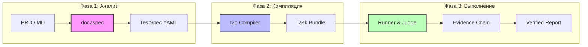

<div align="center">

# 🤖 TesterAgent

**Автоматизированная платформа тестирования промышленного уровня «от документа к агенту»**

*Интеллектуальная самобалансирующаяся мобильная тестовая платформа, управляемая документацией*

<p align="center">
  <a href="README.md">简体中文</a> •
  <a href="README.en.md">English</a> •
  <a href="README.de.md">Deutsch</a> •
  <a href="README.es.md">Español</a> •
  <a href="README.ru.md">Русский</a>
</p>

[Особенности](#✨-особенности) • [Архитектура](#🏗️-архитектура) • [Веб-консоль](#🖥️-веб-консоль) • [Быстрый старт](#🚀-быстрый-старт) • [Roadmap](#🗺️-roadmap)


---

[](https://www.python.org/downloads/)
[](https://nextjs.org/)
[](https://fastapi.tiangolo.com/)
[](LICENSE)

**Превращайте требования напрямую в результаты тестирования.**  
TesterAgent автоматически преобразует PRD на естественном языке в структурированные спецификации тестирования, выполняет их на реальных устройствах с помощью интеллектуальных агентов и формирует отчеты с полной цепочкой доказательств.

</div>

---

## ✨ Особенности

### 1. 📄 Документ как код
Больше не нужно писать тестовые скрипты вручную. Загрузите PRD в формате Markdown/PDF, и система автоматически извлечет точки тестирования для генерации стандартизированных файлов `TestSpec`.

### 2. 🧠 Выполнение под управлением агента
Адаптивный механизм тестирования на базе LLM. Не нужны селекторы или фиксированная логика ожидания. Агент понимает экран и выполняет задачи подобно человеку.

### 3. 🛡️ Безопасность промышленного уровня
- **Guard-зоны**: Автоматическое выявление и ограничение рискованных действий (оплата, удаление аккаунта).
- **Human-in-the-loop**: Критические этапы (например, 2FA) автоматически запрашивают вмешательство человека.

### 4. 📊 Вердикт на основе доказательств
Никаких «черных ящиков». Каждое утверждение (assertion) привязано к конкретным OCR или изображениям, что обеспечивает 100% прослеживаемость.

### 5. 🖥️ Полнофункциональная веб-консоль
Современный интерфейс управления с зеркалированием экрана в реальном времени (Live View), мониторингом конвейера задач и глубоким анализом истории.

---

## 🏗️ Архитектура

TesterAgent использует трехуровневую архитектуру конвейера, гарантируя детерминированность и настраиваемость каждого шага — от требований до выполнения.



---

## 🖥️ Веб-консоль

**TesterAgent предлагает минималистичную, но мощную веб-панель управления.**

> [!TIP]
> Используйте веб-консоль для управления масштабными параллельными задачами.

- **Зеркалирование экрана**: Трансляция экрана устройства с миллисекундной задержкой для отслеживания действий Агента.
- **Конвейер задач**: Визуализация всего процесса: Компиляция -> Запуск -> Оценка -> Отчет.
- **Центр устройств**: Подключение физических устройств через ADB/HDC с возможностью блокировки/разблокировки в один клик.
- **Запросы на перехват**: Автоматические уведомления, если Агенту требуется помощь на этапах логина или оплаты.

---

## 🚀 Быстрый старт

### Требования
- Python 3.10+
- Node.js 18+ (для веб-консоли)
- Среда ADB / HDC (для тестирования на реальных устройствах)

### 1. Установка бэкенда
```bash
git clone https://github.com/your-org/TesterAgent.git
cd TesterAgent
python3 -m venv .venv
source .venv/bin/activate
pip install -e ".[dev,zhipu]"

# Настройка переменных окружения
cp .env.example .env
# Укажите ZHIPU_API_KEY
```

### 2. Установка и запуск фронтенда
```bash
cd web
npm install
npm run dev
```

### 3. CLI рабочий процесс
```bash
# Компиляция спецификации из документа
doc2spec compile examples/wechat_prd.md -o out/

# Компиляция в задачу для Агента
t2p compile out/specs/wechat_prd-TS-001.yaml -o bundles/

# Запуск на реальном устройстве (укажите ID устройства)
runner run bundles/wechat_prd-TS-001_bundle/ --device "YOUR_ADB_ID"
```

---

## 📂 Основные компоненты

| Компонент | Описание | Результат |
| :--- | :--- | :--- |
| **doc2spec** | Анализ требований и синтез спецификаций | `.yaml` (TestSpec) |
| **t2p** | Компилятор стратегий Агента | `Task Bundle` (Prompts + Policies) |
| **runner** | Движок выполнения и сбора доказательств | `steps.jsonl` + `screenshots/` |
| **verdict** | Система атомарной оценки на основе улик | `verdict.json` (Статус прохождения) |

---

## 🗺️ Roadmap

- [x] **v0.1** - Базовый трехуровневый конвейер
- [x] **v0.5** - Next.js Веб-консоль и WebSocket Live View
- [x] **v1.0** - Внепоточная логика компиляции, управление задачами
- [ ] **v1.2** - Интеграция моделей: поддержка GPT-4o / Claude 3.5 для утверждений
- [ ] **v1.5** - Экспорт отчетов в PDF/Excel в один клик
- [ ] **v2.0** - Параллельное выполнение на HarmonyOS / iOS

---

## 📄 Лицензия

Этот проект распространяется под [лицензией MIT](LICENSE).

---

<div align="center">

**[Документация](docs/intro.md) | [Участие в разработке](CONTRIBUTING.md) | [Связаться с нами](mailto:hwangshuaige@gmail.com)**

Built with ⚡ by Sharon & TesterAgent Team

</div>
