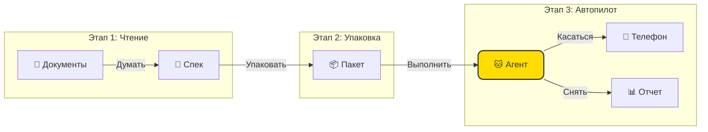

<div align="center">


# 🐱 TesterAgent

**Документация — это функциональность, как по волшебству! ✨**

*Интеллектуальная платформа автоматизации, которая превращает PRD-документы в отчеты о тестировании.*

<p align="center">
  <a href="README.md">简体中文 🇨🇳</a> •
  <a href="README.en.md">English 🇺🇸</a> •
  <a href="README.de.md">Deutsch 🇩🇪</a> •
  <a href="README.es.md">Español 🇪🇸</a> •
  <a href="README.ru.md">Русский 🇷🇺</a>
</p>

[](https://www.python.org/)
[](https://nextjs.org/)
[](https://www.zhipuai.cn/)
[](LICENSE)

</div>

---

## 🐾 Мяу~ Добро пожаловать в TesterAgent!

**Я ваш полностью автоматизированный помощник по тестированию!** 
Устали писать бесконечные тестовые сценарии? Нервничаете из-за частых изменений требований?
Просто скормите мне ваши PRD-документы, и оставьте остальное этому умному котенку! Я прочитаю документы как человек, возьму телефон и выполню все тесты за вас! 📱⚡

> **Менеджер по продукту говорит**:
> "Это не просто инструмент тестирования; это платформа, которая говорит на человеческом языке. Точная, милая и приятная в использовании!"

---

## ✨ Каковы мои суперсилы? (Функции)

### 1. 📖 Документ как код (Document-as-Code)
**Скажи «нет» механической работе!**
Не нужно писать код строка за строкой. Дайте мне документ о продукте в формате Markdown, и я пойму логику и автоматически сгенерирую тестовые случаи. У меня отличное понимание прочитанного! 🧠

### 2. 🤖 Выполнение под управлением агента
**У меня есть глаза!**
Мне не нужны холодные, жесткие селекторы `id` или `xpath`. Я смотрю на экран так же, как вы, распознавая кнопки, значки и текст. Интерфейс изменился? Без проблем, я вижу новый вид! 👀

### 3. 🛡️ Безопасность прежде всего
**Я хорошая киса, я веду себя хорошо!**
Не волнуйтесь, у меня есть защитные ограждения. Опасные действия, такие как удаление аккаунтов или платежей, строго запрещены без вашего разрешения. Ваша производственная среда в безопасности со мной. 🔒

### 4. 📸 Вердикт, основанный на доказательствах
**Фото или этого не было!**
Я не просто говорю вам "Прошел" или "Не прошел". Я делаю скриншоты каждого шага. Смотрите точно, что произошло и где что-то пошло не так. Больше никаких споров! 📷

### 5. 🖥️ Красивая веб-консоль
**Работа должна быть красивой!**
Мощные функции, упакованные в великолепный дизайн. Смтрите, как я работаю, через прямую трансляцию экрана, и отслеживайте каждый шаг в представлении конвейера. Кто сказал, что инструменты разработчика должны быть уродливыми? 🎨

---

## 🏗️ Как я работаю? (Архитектура)

Это просто, правда. Всего три шага:



---

## 🚀 Руководство по усыновлению (Быстрый старт)

### Кошачий корм (Требования)
- Python 3.10+
- Node.js 18+ (Для красивого интерфейса)
- Телефон Android, подключенный через ADB

### 1. Разбудите бэкенд
```bash
git clone https://github.com/your-org/TesterAgent.git
cd TesterAgent
python3 -m venv .venv
source .venv/bin/activate
pip install -e ".[dev,zhipu]"

# Не забудьте мой ключ API Zhipu!
cp .env.example .env
# Отредактируйте .env и введите ключ
```

### 2. Запустите красивый интерфейс
```bash
cd web
npm install
npm run dev
# Откройте http://localhost:3000
```

---

## ❤️ Особая благодарность

Этот проект получает огромную пользу от работы с открытым исходным кодом **Zhipu AI**.
Большое спасибо команде **AutoGLM** за их выдающийся вклад в сообщество, позволяющий агентам так плавно управлять телефонами! 🚀

---

<div align="center">

**[📚 Документация](docs/intro.md) | [🤝 Вклад](CONTRIBUTING.md) | [📫 Контакт](mailto:hwangshuaige@gmail.com)**

Создано с ❤️ и 🐱 Шэрон и командой TesterAgent

</div>
